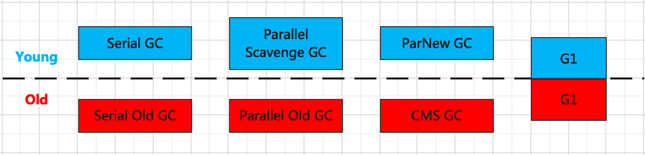

# GC垃圾回收
垃圾回收器主要分为：
* Serial Garbage Collector 串行垃圾回收器（-XX:+UseSerialGC）
* ParNew Garbage Collector 新生代并行垃圾回收器（-XX:+UseParNewGC）
* Parallel Scavenge Garbage Collector 并行垃圾回收器（-XX:+UseParallelGC）
* Parallel Old Garbage Collector 老年代并行垃圾回收器（-XX:+UseParallelOldGC）
* CMS Garbage Collector 并发标记扫描垃圾回收器（-XX:+UseConcMarkSweepGC）
* G1 Garbage Collector G1垃圾回收器（-XX:+UseG1GC）



### Serial Garbage Collector
串行，垃圾回收的过程中会持有所有应用程序线程导致Stop The World；新生代采用复制算法，老年代采用标记压缩。

### ParNew Garbage Collector
新生代并行，采用复制算法。

###Parallel Scavenge Garbage Collector
关注系统的吞吐量，用于新生代，可通过相关参数打开自适应调节策略，也可根据参数控制GC时间或比例；采用复制算法。

### Parallel Old Garbage Collector
用于老年代，采用标记整理法。

### CMS Garbage Collector
并发收集，低延迟；但易产生大量空间碎片，并发会降低吞吐量。主要包括四步：初始标记、并发标记、重新标记、并发清除。
其中初始标记和重新标记会导致Stop The World，

### G1 Garbage Collector


总结：  

|垃圾收集器|串/并行|新生/老年代|使用算法|特点|适用场景|  
|---|---|---|---|---|---|
|Serial|串行|新生代|复制算法|响应速度优先|适用于单CPU下client模式
|Serial Old|串行|老年代|标记压缩算法|响应速度优先|适用于单CPU下client模式
|ParNew|并行|新生代|复制算法|响应速度优先|多CPU模式Server模式与CMS配合使用
|Parallel|并行|新生代|复制算法|吞吐量优先|适用于后台运算而不需要太多交互的场景
|Parallel Old|并行|老年代|标记压缩算法|吞吐量优先|适用于后台运算而不需要太多交互的场景
|CMS|并发|老年代|标记清除法|响应速度优先|适用于互联网或B/S业务
|G1|并发、并行|新生代、老年代|标记压缩、复制算法|响应速度优先|面向服务端应用

## GC日志分析
GC日志相关参数：

|参数|含义|
|---|---|
|-Xloggc:./gc-%t.log|生成gc日志文件所放路径，./为当前路径下
|t%|时间
|-XX:+PrintGCDetails|打印gc详细信息
|-XX:+PrintGCDateStamps|打印gc发生的日期戳
|-XX:+PrintGCTimeStamps|打印gc发送的时间戳
|-XX:+PrintGCCause|打印gc原因
|-XX:+UseGCLogFileRotation|滚动记录日志
|-XX:+NumberOfGCLogFiles=10|gc文件总数，当文件大小超过设置大小则累加一个gc日志文件
|-XX:GCLogFileSize=10M|每个文件大小为10M

num1>num2(num3)  
num1：代表gc前的某空间使用容量  
num2：代表gc后的某空间使用容量  
num2：代表空间总容量
### Parallel GC日志
#### Minor GC
例：
```java
2024-01-10T17:45:40.296+0800: 1.285: 
[GC (Allocation Failure) [PSYoungGen: 49152K->3892K(57344K)] 49152K->3900K(188416K), 0.0080059 secs] 
[Times: user=0.03 sys=0.00, real=0.01 secs]
```
|参数|含义|
|---|---|
|GC(Allocation Failure)|minor gc(分配空间失败)
|PSYoungGen|年轻代
|49152K->3892K(57344K)]|49152K指年轻代gc前使用容量，3892K指年轻代gc后使用容量，57344K指年轻代当前总容量
|49152K->3900K(188416K)|49152K指老年代gc前使用容量，3900K指老年代gc后使用容量，188416K指老年代当前总容量
|0.0080059 secs|gc执行时长

#### Full GC
例：
```java
2024-01-10T17:45:40.450+0800: 5.285:
[Full GC (Metadata GC Threshold) 
[PSYoungGen: 4286K->0K(201216K)]
[ParOldGen: 3289K->7277K(74752K)] 7575K->7277K(275968K), 
[Metaspace: 20854K->20854K(1069056K)] 0.0542303 secs]
[Times: user=0.03 sys=0.00, real=0.01 secs]
```
|参数|含义|
|---|---|
|Full GC (Metadata GC Threshold)|Full GC(分配元空间失败)
|PSYoungGen|年轻代
|4286K->0K(201216K)|4286K指年轻代gc前使用容量，0K指年轻代gc后使用容量，201216K指年轻代当前总容量
|ParOldGen|老年代
|3289K->7277K(74752K)|3289K指老年代gc前使用容量，7277K指老年代gc后使用容量，74752K指老年代当前总容量
|7575K->7277K(275968K)|7575K指整个堆gc前使用容量，7277K指整个堆gc后使用容量，275968K指整个堆当前总容量
|Metaspace|元空间
|20854K->20854K(1069056K)|20854K指元空间gc前使用容量，20854K指元空间gc后使用容量，1069056K指元空间当前总容量
|0.0542303 secs|gc执行时长

### CMS GC日志
```java
-Xloggc:./gc-cms-%t.log -Xms10M -Xmx10M -XX:MetaspaceSize=256M -XX:MaxMetaspaceSize=256M -XX:+PrintGCDetails -XX:+PrintGCDateStamps -XX:+PrintGCTimeStamps -XX:+PrintGCCause -XX:+UseGCLogFileRotation -XX:NumberOfGCLogFiles=10 -XX:GCLogFileSize=100M -XX:+UseParNewGC -XX:+UseConcMarkSweepGC
```

### G1 GC日志
```java
 -Xloggc:d:/gc-g1-%t.log -Xms10M -Xmx10M -XX:MetaspaceSize=256M -XX:MaxMetaspaceSize=256M -XX:+PrintGCDetails -XX:+PrintGCDateStamps -XX:+PrintGCTimeStamps -XX:+PrintGCCause -XX:+UseGCLogFileRotation -XX:NumberOfGCLogFiles=10 -XX:GCLogFileSize=100M -XX:+UseG1GC
```