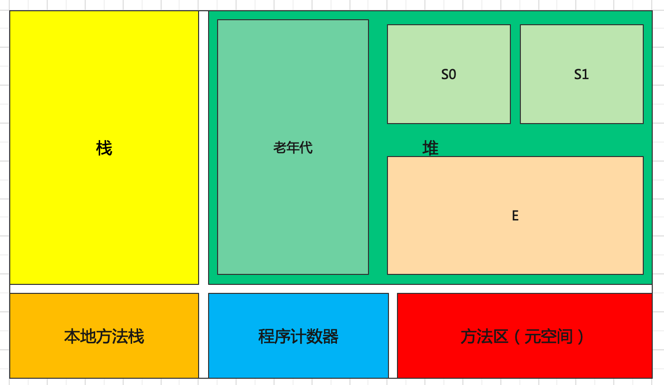

# JVM内存模型
jvm内存模型主要分为栈、堆、本地方法栈、程序计数器、方法区。
其中栈、本地方法栈和程序计数器是线程私有的，堆和方法区是线程共有的。

## 一、栈
用于存储局部变量表、操作数栈、动态链接、方法出口等信息。（栈里面存的是地址，实际指向的是堆里面的对象）每一个方法被调用直至执行完成的过程，就对应着一个栈帧在虚拟机栈中从入栈到出栈的过程。
栈虽然在方法运行完毕了之后被清空了，但是堆上面并没有被清空，所以引出了GC（垃圾回收），不能立马删除，因为不知道是否还有其它的也是引用了当前的地址来访问的。 

* 局部变量表
存储基本数据类型，如果是引用数据类型，则存储其堆中内存地址。
* 操作数栈
操作运算时的一块临时空间来存放操作数。
* 动态链接
将代码的符号引用转换为在方法区（运行时常量池）中的直接引用。
* 方法出口
存储栈帧中的方法执行完后回到上一层方法的位置。

## 二、堆
java 虚拟机中内存最大的一块，是被所有线程共享的，几乎所有的对象实例都在这里分配内存。

## 三、本地方法栈
用于管理本地方法的调用，里面并没有我们写的代码逻辑，其由native修饰，由 C 语言实现。

## 四、程序计数器
指向程序当前运行的位置。
它是一块很小的内存空间，主要用来记录各个线程执行的字节码指令的地址，例如，分支、循环、线程恢复等都依赖于计数器。

## 五、方法区
用于存放已被虚拟机加载的类信息，常量，静态变量等数据。
